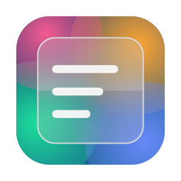
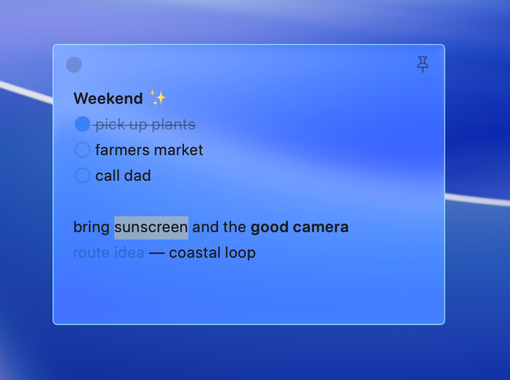
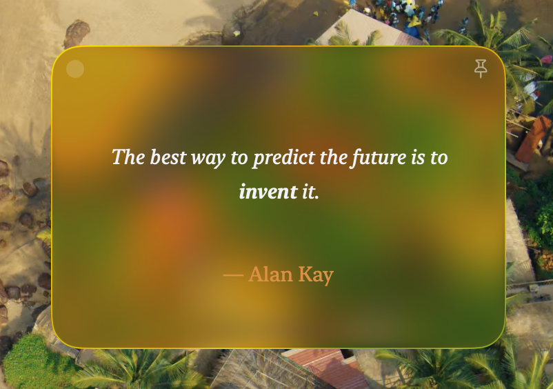
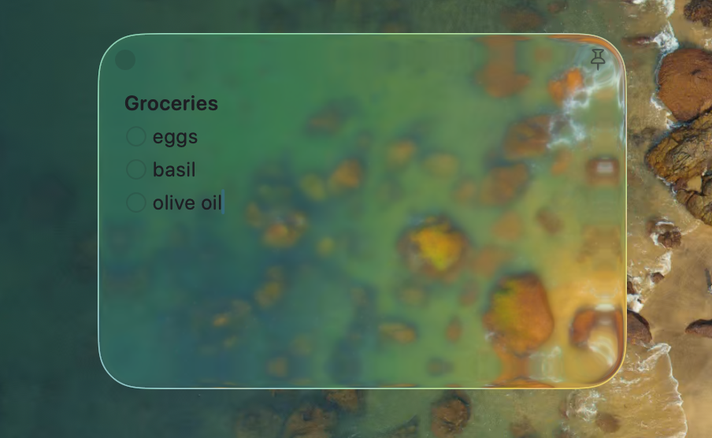

<p align="center">
  
</p>

<h1 align="center">Better Stickies</h1>

<p align="center">
  <b>Sticky notes made of Liquid Glass.</b><br>
  Clear, refractive notes that float on your desktop — from crystal glass to solid color, one setting at a time.
</p>

<p align="center">
  <a href="../../releases/latest"></a>
  
  
  <a href="LICENSE"></a>
</p>

<p align="center">
  
</p>

<p align="center">
  
  
</p>

---

## Why

macOS Stickies hasn't changed since the '90s. Better Stickies rebuilds the idea around
macOS 26's Liquid Glass: notes are real glass panes that refract and saturate whatever
is behind them, with a modern editor inside and a design that stays out of your way —
a note is just a close dot, a pin, and your text.

## Features

- **Liquid Glass panes** — genuinely clear glass with edge refraction over a
  color-saturating backdrop. Eight glass levels, from crystal to fully opaque.
- **Rich text** — bold, italic, underline, strikethrough, ink colors, highlighter,
  four typefaces, per-note text size.
- **Markdown shorthands** — `- ` becomes a bullet, `[] ` a checkbox, `**bold**` and
  `*italic*` convert as you type. Nothing auto-continues; you stay in control.
- **Checklists & links** — clickable checkboxes; link selections to websites, files,
  or folders; drag & drop URLs and files straight onto a note.
- **Shape & layout** — corner radius, padding, alignment, and line spacing per note;
  wrap text or scroll it horizontally; fit-to-text height that grows as you type.
- **Collapse** — double-click the top edge and a note rolls up to a slim glass bar.
- **Stash & Library** — closing a note never deletes it; browse and search everything
  with <kbd>⌘⇧L</kbd> and pull notes back onto the desktop.
- **Float on top** — pin a note above every window.
- **Automation-friendly storage** — notes live in one plain JSON file. External tools
  (scripts, agents) can read *and write* it while the app runs; changes are watched
  and merged live without clobbering your edits.

## Install

1. Download the latest zip from [Releases](../../releases/latest).
2. Unzip and drag **Better Stickies.app** into `/Applications`.
3. First launch: right-click the app → **Open** → **Open**
   *(the app isn't notarized — no Apple Developer program behind it)*, or:

   ```sh
   xattr -dr com.apple.quarantine "/Applications/Better Stickies.app"
   ```

Requires **macOS 26** for the full Liquid Glass rendering; earlier versions get a
frosted-blur fallback.

## Keyboard shortcuts

| | |
|---|---|
| <kbd>⌘N</kbd> | New sticky |
| <kbd>⌘W</kbd> | Close (stashes to the Library) |
| <kbd>⌘⇧L</kbd> | Library |
| <kbd>⌘S</kbd> | Save a copy as Markdown |
| <kbd>⌘B</kbd> / <kbd>⌘I</kbd> / <kbd>⌘U</kbd> / <kbd>⌘⇧X</kbd> | Bold / italic / underline / strikethrough |
| <kbd>⌘L</kbd> | Checklist line |
| <kbd>⌘K</kbd> | Add link |
| <kbd>⌘+</kbd> / <kbd>⌘−</kbd> | Bigger / smaller text |
| <kbd>⌘{</kbd> / <kbd>⌘\|</kbd> / <kbd>⌘}</kbd> | Align left / center / right |
| <kbd>⌘⇧F</kbd> | Float on top |

Everything else lives in the **Note** and **Format** menus.

## Build from source

Requires Xcode 26 — the app links `NSGlassEffectView`, which needs the macOS 26 SDK
(the build script pins `DEVELOPER_DIR` accordingly).

```sh
git clone https://github.com/jamesgalante/better-stickies.git
cd better-stickies
Scripts/make_app.sh        # build + install to /Applications
Scripts/make_release.sh    # build + package dist/Better-Stickies-*.zip
```

## How the glass works

There is no public API for most of what these notes do. Each pane is an
`NSGlassEffectView` (clear style) over a rewritten `NSVisualEffectView` backdrop —
fog washes hidden, saturation boosted, sampling forced to full resolution — plus a
handful of carefully documented private-API overrides that keep the glass lively when
windows lose focus. Every override in
[`Window.swift`](Sources/Stickies/Window.swift) states the symptom it fixes and fails
safe: if a future macOS renames the internals, notes fade to standard materials
instead of breaking.

## License

[MIT](LICENSE)
